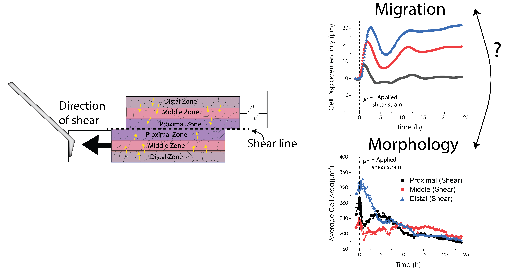
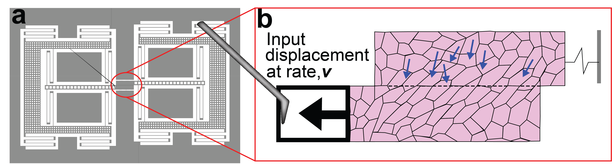

# Predicting Cell Behavior from Cell Morphology during Cell-Cell Shear



### ECE594N HW Shapes 

__Samuel Feinstein, Amil Khan, Lauren Washington, Alice Mo__

- __Sam__ provided the idea of the project, data, and pre-processing of the data
- __Amil__ built the dictionary representation, wrote helper functions, and performed cell analysis
- __Lauren__ provided the idea of using SRV, and provided initial visualizations
- __Alice__ lead the entire visualization portion

As a side note, our first initials are one letter away from SALAD.

📸 Images from Liam Dow


## Data Source

> Ehsan Sadeghipour, Miguel A Garcia, William James Nelson, Beth L Pruitt (2018) Shear-induced damped oscillations in an epithelium depend on actomyosin contraction and E-cadherin cell adhesion eLife 7:e39640 https://doi.org/10.7554/eLife.39640


# Introduction and Motivation

Cell-cell shear, or the action of cells sliding past each other, has roles in development, disease, and wound healing. Throughout development cells are moving past each other in every stage of development. These biomechanical cues have influences on differentiation, cell shape, behavior, the proteome, and the transcriptome. 

Previous research on shear focused on fluid shear so in this paper they focused on cell-cell shear which has been well characterized. Epithelial cells known as MDCK cells were used on a MEMS device which can be precisely displaced to create consistent cell-cell shear forces. Using new segmentation and machine learning techniques we are reanalyzing the data to use the changes in cell shape to predict cell behavior/migration.




## Load Data

Here we define large-scale to mean >1K cells, simply because this is when our MacBook Pros started taking several minutes for certain computations. So we switched to a more powerful machine (32 Cores, 128GB RAM) to process and analyze the data. 

#### 🚨 ATTENTION 🚨
If you are trying to run our analysis, you need to download the data from the original paper. Once downloaded, run the dictionary building portion, and save the data using the provided `JSON` code. You can reach out to us for the processed data as well. We are currently not hosting it anywhere. 

__Folder Structure__

```
├── 01082017_ECR_10x__0minstart_aftershear__30secintervals_1
│   └── Cropped_Images
│       ├── Bottom_plank_0
│       ├── Bottom_plank_1
│       ├── Bottom_plank_2
│       ├── Top_plank_0
│       ├── Top_plank_1
│       └── Top_plank_2
├── 01082017_ECR_10x__15minstart_beforeshear__30secintervals_1
│   └── Cropped_Images
│       ├── Bottom_plank_0
│       ├── Bottom_plank_1
│       ├── Bottom_plank_2
│       ├── Top_plank_0
│       ├── Top_plank_1
│       └── Top_plank_2
├── 01082017_ECR_10x__30minstart_aftershear__5minintervals_1
│   └── Cropped_Images
│       ├── Bottom_plank_0
│       ├── Bottom_plank_1
│       ├── Bottom_plank_2
│       ├── Top_plank_0
│       ├── Top_plank_1
│       └── Top_plank_2
└── 01082017_ECR_10x__60minstart_beforeshear__5minintervals_1
    └── Cropped_Images
        ├── Bottom_plank_0
        ├── Bottom_plank_1
        ├── Bottom_plank_2
        ├── Top_plank_0
        ├── Top_plank_1
        └── Top_plank_2

32 directories, 0 files
```

🚨 __This is not even all of it.__ The metadata was stored in the folder and file names which we needed to preserve. Otherwise, we would have a jumbled mess of timepoints with no way to map back. 

Within each ROI folder, there were 61 ROI files for 61 images corresponding to different timepoints. 1 ROI file had on average 130 segmented cells. This was one of the major hurdles when determining how to represent the data, which we eventually went with the dictionary format.

Hence, if we take conservative estimates, we have, 

$$61 \text{ (Images)} \times 130 \text{ (AVG Cells) } \times 24 \text{ (Folders)} = 187,200$$


## 🤖🔥 THATS ALL FOR NOW! 🔥🤖

🚀 If you found this notebook useful, don't forget to star this repo and the `geomstats` repo as well! 
